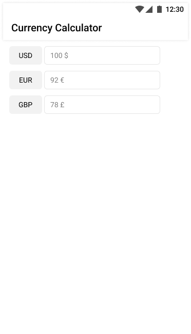

# Goal
The goal is to create a mobile application that displays currency values. Those values will be coming from an API and may change over time. 

Reading ths json is already implemented in `ExchangeRateApi`.

Use `ExchangeRateApi.getExchangeRage()`

```json
[
   {
      "currencyName":"EUR",
      "exchangeRate":0.92
   },
   {
      "currencyName":"GBP",
      "exchangeRate":0.79
   },
   {
      "currencyName":"USD",
      "exchangeRate":1
   },
]
```

The app displays the list of currencies and each currency has a `text input field`.

The input field displays the value for each currency.

When the user edits the input field, we want the app to display the value that the user inputted in each of the currencies that the API returned

### Formula
The mathematical formula to convert between currencies:

```
 amount * (to_rate / from_rate) 
```

### UI inspiration
It doesn't have to look exactly like that

